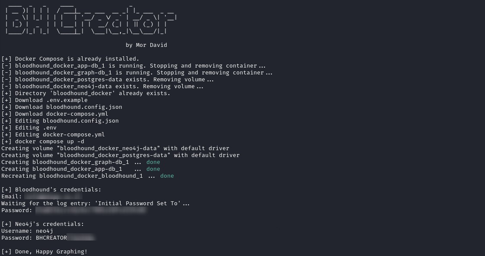

Bloodhound CE deployment include my custom settings in one-liner:
```powershell
 (curl https://raw.githubusercontent.com/MorDavid/BHCreator/refs/heads/main/BHCreator.ps1).content | iex
```
or
```
curl -s -L https://mordavid.com/bhcreator | bash
```
> Required docker-compose: ``` sudo apt install docker-compose ```


